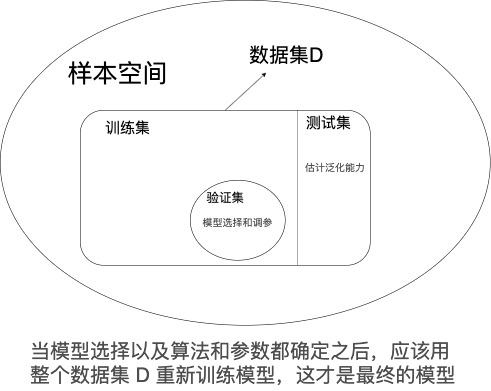

# LearnTF

> 此文档记录机器学习算法相关的基础知识。逐渐更新整理。

## 基本概念

机器学习研究学习算法，即计算机如何从数据中产生模型的算法。

数据中自身存在某种潜在规律，称为“真相/真实（ground-truth）”。学习过程就是为了找出或者逼近真相，机器根据学习算法在数据中学习得到的模型就是学习器（learner）。

训练数据是整个样本空间的很小的采样，我们希望训练数据可以很好的反映样本空间的特性。

1. **数据集（Data set）：样本集合**

一个 *样本* 对应一个<u>*属性空间/样本空间/输入空间*</u> 中的某个点，每个点对应一个坐标向量，所以一个示例也可以称为一个*特征向量*

- 样本/示例（sample / instance）：关于一个对象的描述
- 属性/特征（attribute/feature）：反应被描述对象某方面的表现或者性质的事项。具体对象具体特征的取值成为 *属性值/特征值*
- 标记（label）：训练样本的结果信息。拥有标记信息的 *示例* 称为 *样例*（example）

2. **模型：泛指从数据中学的的结果**

   1. 学习/训练（learning/training）：从数据中习得某个模型的过程
   2. 训练数据（training data）：训练过程中使用的数据
   3. 测试（testing）：得到模型后的预测过程。
   4. 泛化（generalization）能力：模型对新样本的适应能力。具有强泛化能力的模型能很好的适用于整个样本空间。

3. **归纳（induction）和演绎（deduction）：前者是特殊到一般的泛化过程，后者是从一般到特殊的特化过程**

   狭义的归纳学习：从训练数据中学到 “泛化性能好且语义明确的概念”，即概念学习；
   概念学习太难了，当前机器学习产生的多是“黑箱”模型。

4. **假设（hypothesis）空间：某一个问题的所有可能情况**

   那么可以把训练过程看做 “在所有假设组成的空间中用某个策略进行**搜索**的过程，**目标**是找到与训练集匹配的假设”。最终我们得到一个与训练集一致的假设，这个就是学习的结果（模型）。

5. **归纳偏好：机器学习算法在学习过程中对某种烈性假设的偏好**

   当符合某个训练集的假设有多个时，此时算法根据归纳偏好来选择一个结果。

   任何一个有效的机器学习算法必须有其归纳偏好，否则它将被假设空间中看似在训练集上等效的假设迷惑，无法产生确定的学习结果。

   <u>归纳偏好的实质</u>：是学习算法本身所做出的关于“什么样的模型更好”的假设。

   <u>算法偏好的一般性原则</u>：奥卡姆剃刀（如无必要，勿增实体），即“若有多个假设与观察一致，选择最简单的那个”

   <u>免费的午餐定理</u>：当所有问题出现的机会相同时，所有的学习算法的期望性能都跟随机猜想差不多。但实际情形并非如此，我们只为某个具体问题寻找解决方案。要谈论算法的优劣，必须针对具体的学习问题。

## 模型评估

训练误差：学习器在训练集上的误差

泛化误差：学习器在新样本上的误差

我们希望获得**泛化误差小**的学习器，实际能做的是努力使**经验误差最小化**。

当学习器把训练数据学的太好的时候，很可能产生“过拟合”现象， 过拟合的学习器泛化能力差。一般各类学习算法都会有缓解过拟合风险的措施。

### 训练集/测试集划分

为了评估模型以进行模型选择，我们用“测试误差”来近似替代“泛化误差”，选择测试误差最小的模型。测试误差来自学习器对测试集的预测结果。

那么，我们需要**从数据集 D 中划分出一部分数据作为测试集T**。为了让测试误差更接近泛化误差，测试集要尽量与训练集互斥。

​**存在问题**：实际要得到的模型是 在数据集 D 上训练出来的模型 M~D~。划分出 T 之后，实际评估的模型是在 （D-T）数据上训练出的模型M~D-T~，这两个模型并不等价，存在差异。所以要选择合适的划分方法尽量的去减小这个差异。

#### 留出法

#### K折交叉验证

#### 自助法

### 性能度量

评估学习器的泛化性能，需要可以衡量泛化能力的评价标准。

#### 错误类和精度

#### 混淆矩阵：查准率、查全率与 F1

#### ROC 和 AUC

#### 代价敏感错误率与代价曲线

### 学习器的性能比较

学习器的性能比较涉及到很多**重要因素**：

1. 在测试集上的<u>预测性能</u>并不等价于学习器的<u>泛化性能</u>
2. 测试集的选择和<u>测试集的优劣</u>非常影响结果
3. 学习算法本身就有随机性。即便算法相同、参数相同，多次在同一个测试集上的运行结果可能不同

统计假设检验：基于假设检验结果我们可以推断出，如果在测试集上学习器 B 的预测效果优于 A，那么在统计意义上，B 的泛化能力是否优于 A，以及，这个阶段的把握有多大。

### 假设检验

#### 二次检验

#### t 检验

#### 交叉验证 t检验

#### 5X2 交叉验证

#### McNemar检验

#### Fridman 检验与 Nemenyi 后续检验

### 偏差与方差

偏差方差分解：用来解释学习算法的泛化性能。<u>学习器的泛化误差</u>可以分解为<u>偏差、方差和噪声之和</u>。

+ 偏差：度量了学习算法的期望预测与真实结果的偏离程度。刻画了算法的拟合能力
+ 方差：度量了同样大小的训练集的变动导致的学习性能的变化。刻画了数据扰动造成的影响
+ 噪声：表达了当前任务上任何算法所能达到的期望泛化误差的下界。刻画了学习任务本身的难度

综上：**算法性能是由学习算法的能力、数据的充分性、学习任务难度所共同决定的。**

偏差方差窘境（bias-variance dilemma）：

随着训练程度的加深，模型对数据的拟合程度加深，泛化误差的主因慢慢由偏差主导转向方差主导。

## 线性模型

线性模型简单，但可以是很多复杂的非线性模型的基础。在线性模型上引入层级结构或者高维映射。

**w 的意义**：直观地表达了各属性在预测中的重要性。

### 线性回归

给定数据集，线性回归试图学习一个线性模型来预测实值输出标记。

学习目标：最小化均方误差

求解方法：最小二乘法

归纳偏好：正则项

更多变化：广义线性模型

### 对数几率回归

一个优秀的分类算法。线性模型一种。

### softmax 回归

多分类算法

成本函数：交叉熵

### 线性判别分析

思想：给定训练集，将所有的样例都投影到一条直线上，使得同类样例的投影点尽可能近，异类样例的投影点尽可能远。

**求解目标**：最小化同类样例投影点的协方差+最大化类中心之间的距离。据此定义的求解目标，广义瑞利商（generalized Rayleigh quotient）

**求解方法**：拉格朗日乘子法、奇异值分解法

从贝叶斯决策理论角度来理解 LDA：当两类数据同先验、满足高斯分布且协方差相等时，LDA 可达最优解。

推广：到多分类问题、经典降维

### 多分类学习

特例：部分二分类方法可以直接推广到多分类

一般策略：拆解法，将多分类问题拆分为二分类问题。然后为每一个二分类问题训练一个分类器。最后用这些分类器的集成结果作为最终的多分类结果。

核心问题：任务拆分策略（OvO、OvR、MvM）

OvO 预测结果：投票产生

OvR 预测结果：考虑分类器的预测置信度，最后选择置信度最大的

MvM 的正反类构造必须经过特定的设计，不能随意选取。最常见的一种技术：纠错输出码（Error Correcting Output Codes， ECOC）

- 编码：N 个类别做 M 次划分，产生 M个训练集，训练出 M 个分类器
- 解码：将 M 个预测结果编码得到一个预测编码，然后选择距离最小的类别（每个类别都有自己的编码）作为最终预测结果。

编码矩阵指定类别划分。

性能规律：

1. ECOC 对分类器的错误有一定的容忍和修正能力。一般，编码越长，纠错能力越强，但相应的计算和存储开销也会增大。而且类别有限，所以长度超过一定范围后也就失去了意义
2. 同等长度的编码，任意两个类别之间的编码距离越远，纠错能力就越强。

### 类不平衡问题

描述：

解决方案：

1. 欠采样
2. 过采样
3. 阈值移动

## 决策树

学习一棵泛化能力强的树：分而治之，每次选择一个属性，根据属性值往下延伸分支

学习算法关键：如何选择最优划分属性。

指导思想：随着划分的进行，往下分的结点的纯度应该越来越高。每次应该选择对提纯帮助最大的属性来划分。

衡量属性帮助提纯能力的指标。

#### 划分选择

##### 信息增益

##### 增益率

##### 基尼系数

#### 剪枝处理

剪枝是决策树避免“过拟合”的手段。

##### 预剪枝

先判断，有提升再划分

##### 后剪枝

生成完整决策树，再自底而上对非叶子结点考察，如果将对应子树替换为叶子结点能够提升树的泛化性能，就替换。

欠拟合风险更小。但训练时间开销比未剪枝和预剪枝决策树大很多。

#### 处理连续值和缺失值

##### 连续值离散化：二分法

##### 缺失值处理

#### 多变量决策树

# 问题记录

## 进一步
1. 《概率论与数理统计》：二项分布，t检验
2. 最小二乘法、极大似然法、梯度下降法、牛顿法
3. 正则项：归纳偏好方法
4. 拉格朗日乘子、奇异值分解
5. 反向传播算法
6. 理解交叉熵
7. 卷积神经网络：神经元 ReLU
8. 神经网络：卷积、池化

## 算法比较
1. softmax 回归 **VS** logistic回归 **VS** 最大熵模型

## 待回答
1. 《机器学习》P66 为什么 对数几率回归 不需要事先假设数据分布
2. 《机器学习》P70 当两类数据同先验、满足高斯分布且协方差相等时，LDA 可达最优解。
